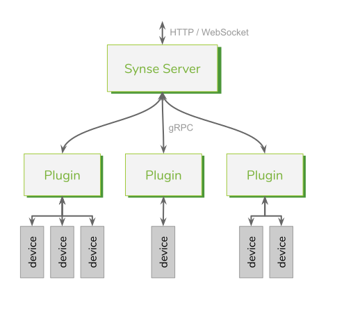

# Synse Platform

**Synse** is a simple, scalable platform which enables detailed monitoring and control
of *physical and virtual devices*. These devices could be data center equipment,
IoT devices, building management systems, or hardware on the edge. The platform is
designed to support remote lights-out management and automation.

There are two core components to the Synse platform, the [API server](server/intro.md) and
[device plugins](plugins.md).

_What Synse Provides_:

- A uniform HTTP API to interface with devices across any protocol
- The ability to read from and write to devices
- Deterministic IDs for devices configured in a Synse deployment

_What Synse Does Not Provide_:

- Persistence of device readings / write actions
- Access control to plugins/devices
- Analytics, inference, or general processing of device data

## Components

### Plugins

Plugins are the direct interface to devices, exposing them to the rest of the platform.

Briefly, a plugin is generally associated with a communication protocol, such as IPMI,
SNMP, HTTP, I²C, etc. If the plugin is generalized, it should only be a matter of configuring
it correctly to get readings for your devices (e.g., specifying the correct I²C registers).

Plugins may also be target-specific. For example, it may not be suitable to use a generalized
HTTP plugin to access a custom REST API, so you may create a plugin that is specific to that
API. Doing so would reduce the configuration burden, as many API-specific details could be
codified into the custom plugin itself.

Regardless of how simple, complex, general, or specific, the job of a plugin is to communicate
with a device, enabling the collection of any data it provides, such as temperature,
humidity, power consumption, LED status, lock state, etc. Additionally, if a device can be
written to, plugins provide a means to issue write requests to those devices. This can range
from simply blinking an LED indicator, to remotely managing a building's HVAC system.

### Server

The server ("Synse Server") provides a simple HTTP and WebSocket API which makes it easy to interact
with the devices exposed by plugins. It routes incoming requests to the appropriate plugin
for the specified device, so the user does not need to worry about where the device is or
what protocol it speaks. The API provides uniform access over HTTP (or WebSocket), meaning that
you can interact with a temperature sensor over RS-485 the same way you would a BMC over IPMI --
and you could do it all with _curl_.

## The Synse Ecosystem

While the server and plugins are the two primary components, there are a number of projects
which make up the *Synse ecosystem*:

* [vapor-ware/synse-server](https://github.com/vapor-ware/synse-server): The API server providing
    a uniform HTTP/WebSocket API to interact with physical and virtual devices via plugin backends.
* [vapor-ware/synse-sdk](https://github.com/vapor-ware/synse-sdk): The official SDK (written in
    Go) for Synse plugin development.
* [vapor-ware/synse-server-grpc](https://github.com/vapor-ware/synse-server-grpc): The gRPC API
    for the bi-directional communication between Synse Server and the Synse plugins.
* [vapor-ware/synse-cli](https://github.com/vapor-ware/synse-cli): A command-line interface to
    interact with the server (via the HTTP API) and plugins (via the gRPC API) directly from
    your console.
* [vapor-ware/synse-client-python](https://github.com/vapor-ware/synse-client-python): A Python
    client for programmatic access to the Synse Server API.
* [vapor-ware/synse-client-go](https://github.com/vapor-ware/synse-client-go): A Golang client
    for programmatic access to the Synse Server API.
