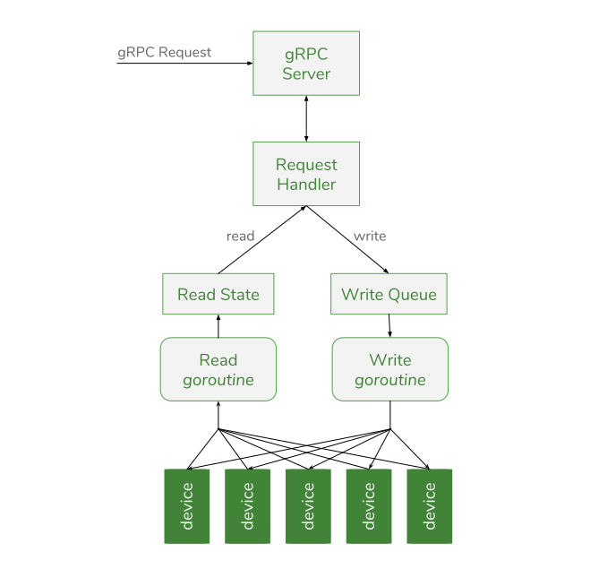

# Synse SDK

> *[github.com/vapor-ware/synse-sdk](https://github.com/vapor-ware/synse-sdk)*

The Synse SDK is the official SDK (written in Golang) for writing Synse plugins. Synse plugins
expose devices to the Synse platform and manage read/write access to those devices. The SDK
handles much of the functionality needed for plugins, including:

- configuration parsing
- executing device reads
- executing device writes
- caching reading data
- transaction generation and tracking
- device info caching
- Synse gRPC API support
- and more

By implementing the majority of the plugin mechanics, a plugin author can focus on the protocol
or device specific code for the plugin. The [Synse CLI](../cli/intro.md) also provides some
useful functionality for plugin development, including a tool to generate a cookie-cutter
template for new plugins.

The Synse Plugin SDK is the official SDK used to write plugins for the Synse platform.
Synse Server provides an HTTP API for monitoring
and controlling physical and virtual devices, but it is the backing plugins that
provide the support (telemetry and control) for all of the devices that Synse Server
exposes.

The SDK handles most of the common functionality needed for plugins, such as configuration
parsing, background read/write, transaction generation and tracking, meta-info caching, and more.
This means the plugin author should only need to worry about the plugin-specific device support.

