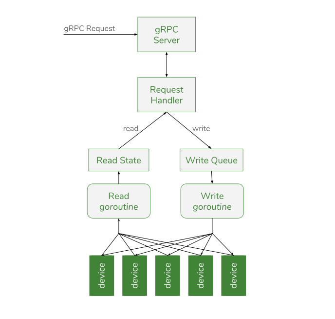

This page describes the SDK architecture at a high level, providing insight into how
a plugin operates. While not required to develop your own plugin, it can be useful
in understanding how to design your plugin, basic assumptions, and where some pitfalls
may lie.

## Overview

The SDK provides an API to make it easier to develop new plugins, abstracting away a lot
of the internal state handling, common functionality, and communication layers from the
plugin author. Ideally, this means that a plugin author spends more time on the
plugin-specific logic and less time integrating it into the Synse platform.

At a high level, there are two levels of communication in a plugin:

- communication with [Synse Server](../../server/intro.md)
- communication with the devices the plugin manages

### Plugin Interaction with Synse Server

When Synse Server receives an API request, e.g. a [read](../../server/api.v3.md#read) request,
Synse Server will determine which plugin manages the targeted device(s) and issue a
corresponding request to those plugins via the [Synse gRPC API](https://github.com/vapor-ware/synse-server-grpc).

The plugin runs a gRPC server and upon receiving the request, will dispatch it appropriately.
At a high level, there are two types of actions that the plugin will handle:

- retrieve 'static' information
- device read/write

When retrieving static information, it will simply look up the pertinent information
from the appropriate SDK component and return it. This includes things like the plugin
metadata, configured devices, plugin health, plugin version, etc.

The read and write behavior is more complicated and describe in more detail in the
next section.

The gRPC layer between Synse Server and a plugin can use either TCP or Unix socket
for the transport protocol.

### Plugin Interaction with Devices

When a plugin starts up, it will load its device configuration and will begin reading from
those devices continually (on a configurable interval). The reading data it gets back is 
kept as the "current" reading state. When a read request comes in from Synse Server, the
response is taken from this "current" reading state. That is to say that a read request never
directly reads from a device, but it gets the reading data from intermediary cached state.

This allows read and write operations to happen constantly and consistently in the background
without having incoming requests dictate the resolution of device readings.

Similarly, when a write request comes in from Synse Server, it is not processed immediately.
Instead, it is put on the "write queue" and is processed in the background on an interval.

The frequency of reads and writes, along with other read/write behavior) is configurable
from the [plugin configuration](configuration.plugin.md#configuration-options).

The diagram below shows this read/write data flow at a high level.

## Components

The SDK has a number of components, each with their own domain of responsibility. Below
is a table which describes what each of the internal components does.

| Component | Description |
| :-------- | :---------- |
| device manager | Loads, maintains, and manages the device instance metadata for the plugin. This is used for device routing and lookups, device info requests, and serves as the source of truth for the devices the plugin should know about. |
| health manager | Loads and runs [health checks](advanced.md#plugin-health) which it aggregates and exposes to provide an overall plugin health status. |
| scheduler | Runs the read/write logic, continuously collecting readings from devices and executing writes off of the write queue. |
| server | The gRPC server which receives requests from Synse Server and generates appropriate responses from the data provided from other components. |
| state manager | Maintains all the internal device state, such as the current readings, windowed reading cache, and write transactions. |

### Scheduler

The scheduler has two run modes:

- **serial**: All reads happen serially, all writes happen serially, and the read loop
  and write loop run serially, alternating between the two.
- **parallel**: All reads happen in parallel, all writes happen in parallel, and the read
  and write loop run in parallel.
  
By default, the scheduler will run in parallel mode, but not all plugins are suited for
this. It is important to determine which mode a plugin will need to run in. For example,
a serial protocol, such as I²C, will fail when run in parallel mode because of collisions
on the serial bus. Alternatively, running in serial mode when a plugin could run in parallel,
e.g. for some HTTP-based plugin, would be detrimental to performance.
