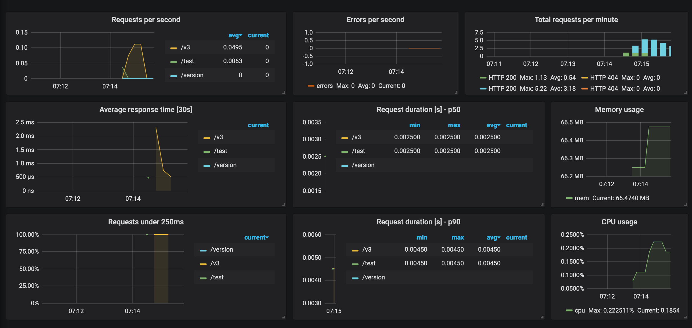

Synse Server does not provide any kind of monitoring solution for the
data that it exposes. It does provide basic application-level metrics via a
[Prometheus](https://prometheus.io) exporter.

## Configuring

By default, application metrics export is disabled. To enable it, you would need
to set the following values in the application [configuration](configuration.md#metrics):

```yaml
metrics:
  enabled: true
```

This can also be done via environment variable

```
SYNSE_METRICS_ENABLED=true
```

## Getting metrics

Once configured, you can run Synse Server and verify that metrics are enabled by
hitting `#!shell http://${server}/metrics`. If enabled, the route should resolve and
you should get Prometheus export data, e.g.

```
# HELP python_gc_collected_objects Objects collected during gc
# TYPE python_gc_collected_objects histogram
python_gc_collected_objects_bucket{generation="0",le="500.0"} 132.0
python_gc_collected_objects_bucket{generation="0",le="1000.0"} 132.0
python_gc_collected_objects_bucket{generation="0",le="5000.0"} 132.0
python_gc_collected_objects_bucket{generation="0",le="10000.0"} 132.0
python_gc_collected_objects_bucket{generation="0",le="50000.0"} 132.0
python_gc_collected_objects_bucket{generation="0",le="+Inf"} 132.0
python_gc_collected_objects_count{generation="0"} 132.0
python_gc_collected_objects_sum{generation="0"} 1045.0
python_gc_collected_objects_bucket{generation="1",le="500.0"} 12.0
...
```

## Exposed metrics

In addition to the default Python metrics (e.g. Python garbage collection, Python info, process memory, etc.),
Synse Server exposes a number of metrics which describe its application performance. Below are a summary
of those metrics.

### HTTP Request Count

| | |
| :--- | :--- |
| **name** | `synse_http_request_count` |
| **description** | The total number of HTTP requests processed. |
| **metric type** | Counter |
| **labels** | `method`, `endpoint`, `http_code` |

### HTTP Request Latency (seconds)

| | |
| :--- | :--- |
| **name** | `synse_http_request_latency_sec` |
| **description** | The time it takes for an HTTP request to be fulfilled. |
| **metric type** | Histogram |
| **labels** | `method`, `endpoint`, `http_code` |

### HTTP Response Bytes

| | |
| :--- | :--- |
| **name** | `synse_http_response_bytes` |
| **description** | The total number of bytes returned in HTTP API responses. |
| **metric type** | Counter |
| **labels** | `method`, `endpoint`, `http_code` |

### WebSocket Request Count

| | |
| :--- | :--- |
| **name** | `synse_websocket_request_count` |
| **description** | The total number of WebSocket requests processed. |
| **metric type** | Counter |
| **labels** | `event` |

### WebSocket Request Latency (seconds)

| | |
| :--- | :--- |
| **name** | `synse_websocket_request_latency_sec` |
| **description** | The time it takes for a WebSocket request to be fulfilled. |
| **metric type** | Histogram |
| **labels** | `event` |

### WebSocket Request Bytes

| | |
| :--- | :--- |
| **name** | `synse_websocket_request_bytes` |
| **description** | The total number of bytes received from WebSocket requests. |
| **metric type** | Counter |
| **labels** | `event` |

### WebSocket Response Bytes

| | |
| :--- | :--- |
| **name** | `synse_websocket_response_bytes` |
| **description** | The total number of bytes returned from the WebSocket API. |
| **metric type** | Counter |
| **labels** | `event` |

### WebSocket Error Response Count

| | |
| :--- | :--- |
| **name** | `synse_websocket_error_response_count` |
| **description** | The total number of error responses returned by the WebSocket API. |
| **metric type** | Counter |
| **labels** | `event` |

### WebSocket Session Count

| | |
| :--- | :--- |
| **name** | `synse_websocket_session_count` |
| **description** | The total number of active WebSocket sessions connected to Synse Server. |
| **metric type** | Gauge |
| **labels** | `source` |

### gRPC Message Sent

| | |
| :--- | :--- |
| **name** | `synse_grpc_message_sent` |
| **description** | The total number of gRPC messages sent to plugins. |
| **metric type** | Counter |
| **labels** | `type`, `service`, `method`, `plugin` |

### gRPC Message Received

| | |
| :--- | :--- |
| **name** | `synse_grpc_message_received` |
| **description** | The total number of gRPC messages received from plugins. |
| **metric type** | Counter |
| **labels** | `type`, `service`, `method`, `plugin` |

### gRPC Request Latency (seconds)

| | |
| :--- | :--- |
| **name** | `synse_grpc_request_latency_sec` |
| **description** | The time it takes for a gRPC request to be fulfilled. |
| **metric type** | Histogram |
| **labels** | `type`, `service`, `method`, `plugin` |


## Viewing application metrics

An example deployment is provided in the project's [GitHub repository](https://github.com/vapor-ware/synse-server/tree/master/examples/monitoring)
which starts up a Synse Server instance, a Prometheus instance to collect application metrics,
and a Grafana instance (with pre-built example dashboard) to visualize those metrics.

From the project source, you can simply run:

```bash
# vapor-ware/synse-server/examples/monitoring/
docker-compose up -d
```

All components will start up and be exposed locally

| Service | Address |
| :------ | :------ |
| **synse-server** | `localhost:5000` |
| **prometheus** | `localhost:9090` |
| **grafana** | `localhost:3000` |

The login for the Grafana dashboard at `localhost:3000` is `admin`/`admin`. Once logged in,
you can select the "Synse Server Application Metrics" dashboard. 

To get requests data, you will need to hit Synse Server [endpoints](../api.v3.md), e.g.

- `localhost:5000/test`
- `localhost:5000/version`
- `localhost:5000/v3/config`
- `localhost:5000/v3/plugin`
- `localhost:5000/v3/scan`
- ...


